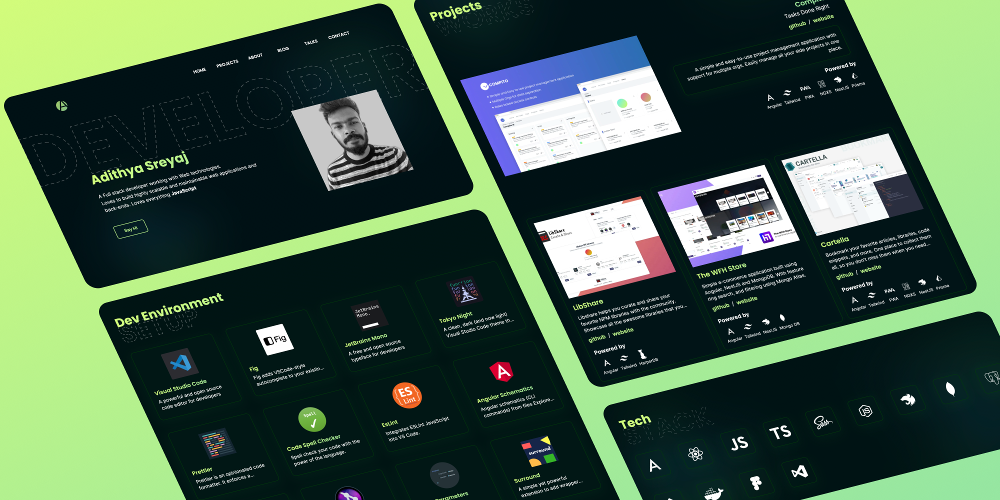
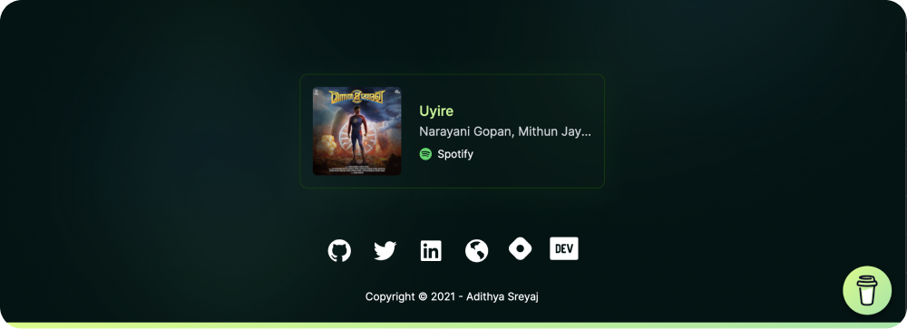

  <p align="center">
   
  </p>

<h3 align="center">Adithya Sreyaj's Portfolio</h3>
Presenting my personal portfolio website where I showcase my career, projects, blogs and more.

I always wanted a portfolio, but wanted something that is different from all the other portfolios out there. One fine day, I got a design idea, just started 
working it a created a mock in figma. It turned out great.

Next day, I started building it out.

## Sections

It's a single page website and is divided into multiple sections. 
- Hero Section
- Projects Showcase
- Career Timeline
- About Section
- Tech Stack
- Blogs Showcase
- Talks/Conference Section
- My Dev Tools
- What am I playing on Spotify?

## Tech Stack

  <p align="center">
   
  </p>

So it's all **JavaScript** because for a very small project like this it might not make that sense to use TypeScript (I Love TypeScript btw!). 
And its only me who will work on this one.

NextJs is just an amazing framework to work with, especially with the file based routing and SSR capabilities. And for styling its TailwindCSS.
With Vercel, deployments are a breeze and you don't have to worry about a thing.

### Links
- Next.Js: https://nextjs.org/
- TailwindCSS: https://tailwindcss.com/
- Vercel: https://vercel.com/

Here is how the files are arranged:

```shell
├── components
├── data
├── lib
├── pages
├── public
└── styles
```

## Data Sources

Data for different sections of the application are sourced from files in the `data` directory. They are just plain JavaScript files.
```shell
├── dev-setup.js
├── job.js
├── project.js
└── talks.js
```
## Blogs Integration

The blogs displayed on the portfolio are from my [Blog](https://sreyaj.dev) which is hosted on Hashnode.
Hashnode provides an API to fetch the posts of a user via a GraphQL query.
```js
const query = gql`
    query {
      user(username: "adisreyaj") {
        publication {
          posts(page: 0) {
            title
            coverImage
            slug
            cuid
            totalReactions
            brief
            dateUpdated
          }
        }
      }
    }
  `;
  const data = await request('https://api.hashnode.com/', query);
  return {
    props: {
      posts: data.user.publication.posts,
      jobs: JOBS,
      projects: PROJECTS,
    },
  };
```
This returns an array of posts of the specified user.

## What am I playing on Spotify?

This is an interesting bit that I added, inspired by the [Lee Rob's blog](https://leerob.io/). 
It shows the current song that I'm listening to on Spotify.



He has written a wonderful blog on how to set up Spotify integration with Next.js.

Read Here:  https://leerob.io/blog/spotify-api-nextjs


## Show your support

Don't forget to ⭐️ the repo if you liked it. Just would mean a lot to me.